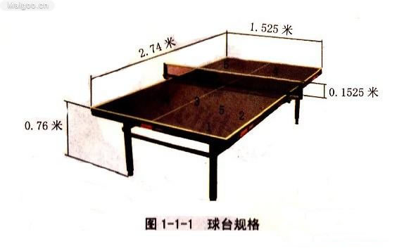

# 单相机乒乓球追踪 #
假设只假设一台相机，我们能否从视频中恢复乒乓球的运动轨迹？

## 相机标定 ##
不使用checkerboard标定，直接利用乒乓球桌的信息来标定相机内外参数

## 如何计算空间坐标 ##
假设先不考虑镜头畸变，则图像上的点p对应于空间的一条直线，方程为:

$$x=\frac{-b\pm\sqrt{b^2-4ac}}{2a}$$
\\(x=\frac{-b\pm\sqrt{b^2-4ac}}{2a}\\)